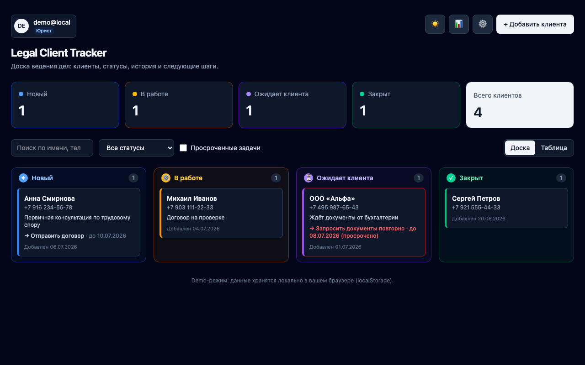
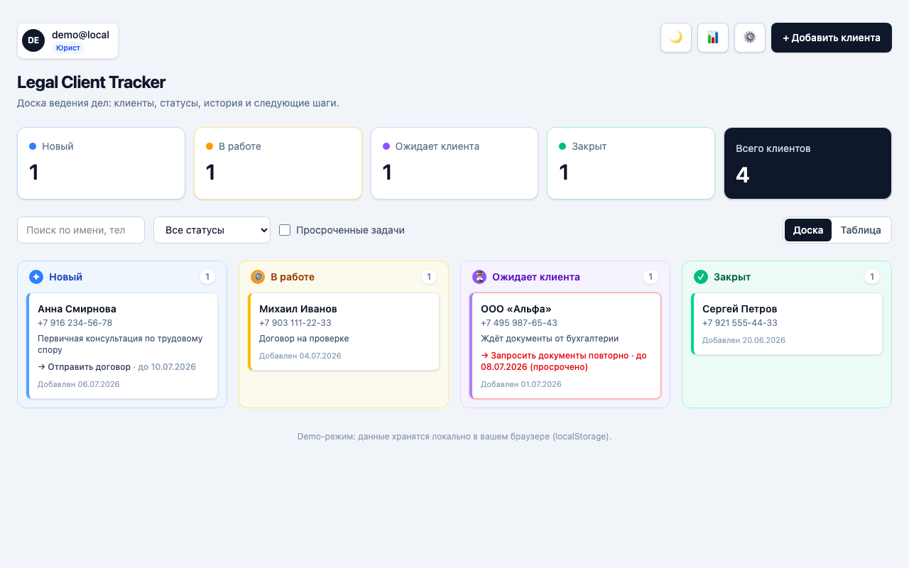
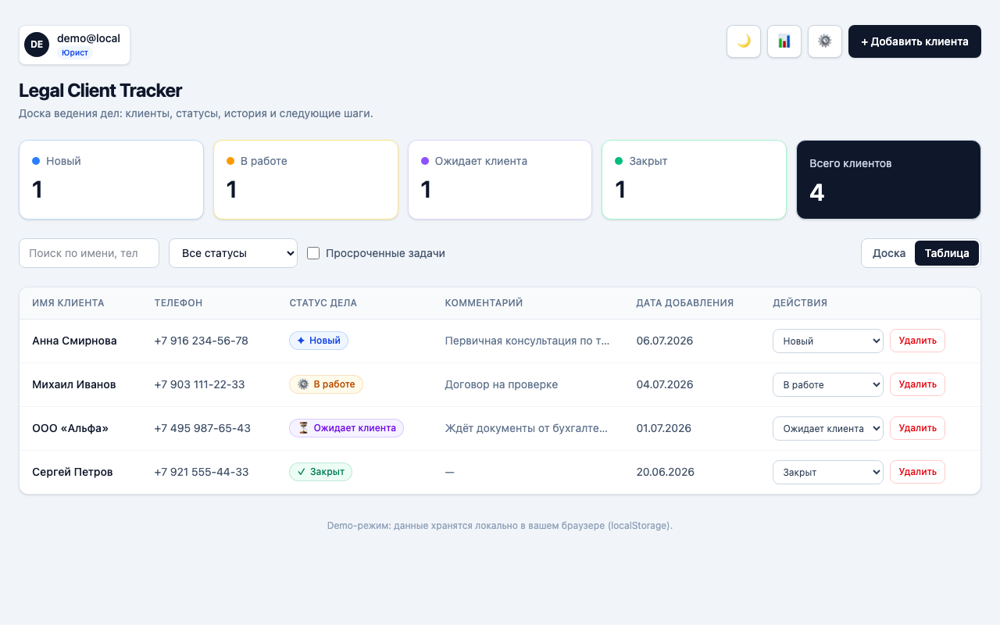
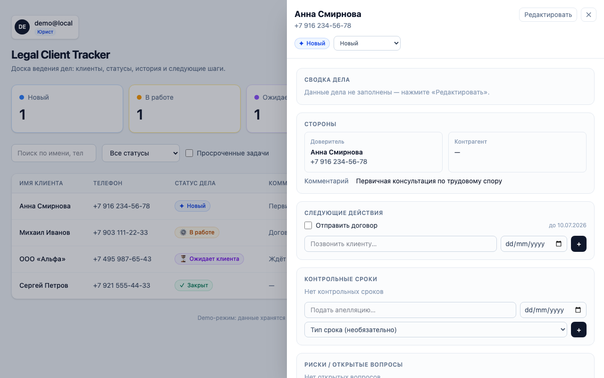
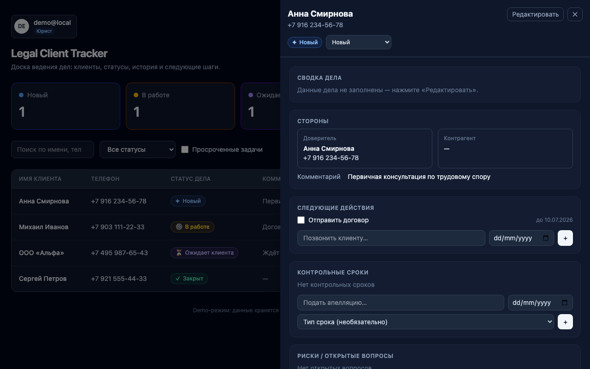
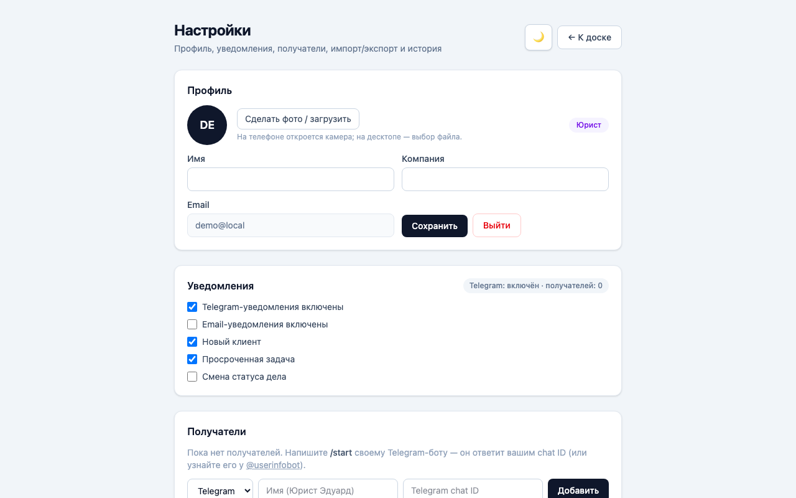

# Legal Client Tracker — lightweight legal CRM

Не просто таблица клиентов, а **case management board**: юрист работает не со строками,
а с делами — открывает клиента, видит историю, документы, заметки, текущий статус и
следующий шаг.

Клиент пришёл → дело взяли в работу → запросили документы → ждём клиента → закрыли дело.

<br clear="left" />

Знакомьтесь — **Элли**, бот-ассистентка проекта: следит за просроченными сроками
и уведомляет о новых клиентах и смене статуса дела в Telegram, чтобы дело не
терялось в переписке (подробнее — [docs/brand/elly-character.md](docs/brand/elly-character.md)).


## Скриншоты

**Доска дел** — канбан по 4 статусам, live-счётчики, поиск/фильтр. Тёмная тема
слева, светлая справа — обе полноценные, не «затемнённый CSS поверх светлой»:

<p>
  
  
</p>

**Табличный вид** — та же доска, но построчно: удобнее, когда дел много и нужно
сравнивать/сортировать, а не листать канбан:



**Карточка дела (drawer)** — открывается по клику на клиента. Каждая секция
(сводка дела, стороны, задачи, контрольные сроки, риски, заметки, документы,
история) — отдельный визуальный блок, а не сплошная стена текста:

<p>
  
  
</p>

**Настройки** — профиль, уведомления (Telegram + email), получатели,
импорт/экспорт CSV, `.ics`-экспорт календаря, история отправок:



## Live Demo

**https://legal-client-tracker.vercel.app**

Тестовый доступ: `test@qalipso.legal` / `testtest` (создан через Supabase
Dashboard → Authentication → Add user, автоподтверждён).

> **This MVP uses only fake/demo client data — no real personal or legal
> data is stored.** For real legal data, the production version should use
> authenticated database storage with access control (уже есть: Supabase
> Auth + RLS), audit logging (уже есть: `case_history`/`notification_events`)
> and encrypted secrets (уже есть: server-side Edge Function secrets) —
> подробности: [docs/security.md](docs/security.md).

## Документация

- [docs/architecture.md](docs/architecture.md) — компоненты, data model, потоки, решения (ADR) и trade-offs
- [docs/security.md](docs/security.md) — data classification, access control, RLS, audit log, AI usage policy, security checklist
- [docs/features.md](docs/features.md) — полный перечень фич проекта с версией и местом в коде
- [docs/setup.md](docs/setup.md) — локальный запуск, Supabase с нуля, Telegram-бот, Vercel deploy
- [docs/notifications.md](docs/notifications.md) — контракт edge function, события, журнал доставки
- [docs/qa/ui-test-plan.md](docs/qa/ui-test-plan.md) — план UI-тестирования (desktop/mobile), найденные и исправленные баги
- [CHANGELOG.md](CHANGELOG.md) — история версий v0.1 → v1.0.1

## Features

**Board / Table**
- Канбан-доска по статусам дел (Новый / В работе / Ожидает клиента / Закрыт)
- **Drag-and-drop**: карточку можно перетащить в другую колонку — статус меняется,
  событие пишется в историю дела; колонка-цель подсвечивается
- Цветовая система статусов: иконки, тонированные колонки, цветной акцент карточек
- Карточка дела: имя, телефон, комментарий, следующее действие с дедлайном
- Подсветка просроченных действий прямо на доске
- Переключатель Доска / Таблица (выбор запоминается)
- Live-счётчики по статусам, поиск по имени/телефону/статусу + фильтр

**Карточка клиента / дела (боковая панель)**
- **Сводка дела** — название, тип дела и стадия из справочников, предмет,
  контрольный срок (с подсветкой просрочки), приоритет
- **Стороны** — доверитель (контакты клиента) и контрагент
- Следующие действия — быстрые задачи (дата, чекбокс, признак «просрочено»)
- **Контрольные сроки** — типизированные юридические дедлайны (процессуальный,
  ответ на претензию, оплата и т.д.), отдельно от быстрых задач
- **Риски / открытые вопросы** — список с отметкой «решено»
- Заметки — сохраняются в историю дела
- Документы — реальная загрузка в приватный Supabase Storage (не только
  имя файла), **тип и статус документа** из справочников, скачивание через
  60-секундные signed URL
- История дела — единый timeline всех событий; история статусов — его срез

**Auth и приватность данных (v0.3)**
- Supabase Auth: регистрация, вход, выход; без сессии приложение показывает
  страницу входа
- Все данные принадлежат пользователю: `user_id` на clients / tasks /
  case_history / attachments + RLS-политики «только свои строки»
- При регистрации триггер автоматически создаёт `profiles` и
  `account_settings` с дефолтами
- Новый пользователь видит welcome empty state, а не чужие данные

**Настройки аккаунта (`#/settings`)**
- Профиль: имя, компания, email (readonly), фото (реальная загрузка в
  Supabase Storage), выход
- Светлая/тёмная тема — переключатель, localStorage + system-preference
- Уведомления: Telegram и Email вкл/выкл + тумблеры по событиям (новый
  клиент, просроченная задача, смена статуса)
- Получатели: Telegram chat ID и/или email-адреса (имя + канал +
  активность), добавление/отключение/удаление, «Отправить тест»
- Импорт/экспорт CSV, `.ics`-экспорт открытых задач и сроков в календарь
- История уведомлений: последние попытки с статусами sent / error / skipped

**Уведомления (Telegram + Email, per-user routing)**
- События: `client.created`, `task.created`, `status.changed`,
  `task.overdue` отправляются на все включённые каналы получателя
- `task.overdue` — автоматически, раз в день (pg_cron → Edge Function),
  не нужно ничего нажимать
- Email без явного получателя по умолчанию идёт на почту аккаунта — не
  нужно ничего донастраивать, чтобы получать уведомления себе
- Edge Function получает JWT пользователя (или internal secret для cron)
  → определяет владельца → читает его настройки и активных получателей →
  шлёт по каждому каналу → пишет каждую попытку в `notification_events`
  (status, error, payload, sent_at)
- Секреты (`TG_BOT_TOKEN`, `RESEND_API_KEY`) только в Supabase secrets; нет
  получателей/токена/ключа → `{"skipped"/"error": ...}`, UI не ломается
- **Подключение Telegram без copy-paste** (v0.8): кнопка «📎 Подключить
  Telegram» создаёт короткоживущий (10 мин) одноразовый токен → открывает
  `t.me/<bot>?start=connect_<token>` → бот (`telegram-webhook`) резолвит
  токен и создаёт (или обновляет — v0.8.2, reconnect не плодит дубликат)
  получателя сам — пользователь никогда не видит и не копирует chat ID.
  Токен: crypto-random, single-use, с TTL, **хранится только как SHA-256
  hash** (v0.8.1, не в открытом виде) — все свойства проверены сквозным
  тестом на проде (валидный/просроченный/повторно использованный/
  переподключённый токен), см. CHANGELOG v0.8–v0.8.2
- Прежний путь (написать боту `/start` вручную) остаётся рабочим fallback'ом
  — отвечает голым chat ID для ручного ввода, если токен истёк/потерян
- Настройка бота с нуля: @BotFather → токен в секреты → задеплоить функции
  → зарегистрировать webhook (см. [docs/setup.md](docs/setup.md))

**Справочники (v0.4)**
- Типы дел, стадии дел, типы документов, статусы документов, типы сроков —
  глобальные таблицы-словари (`matter_types`, `matter_stages`,
  `document_types`, `document_statuses`, `deadline_types`), читаемы всем
  авторизованным пользователям, значения используются в UI как select'ы

**Header, роли, импорт/экспорт, аналитика (v0.5)**
- **Header**: аватар (или инициалы) + имя + бейдж роли в шапке, клик ведёт в
  настройки; фото профиля грузится в Supabase Storage (bucket `avatars`,
  публичный, свой каталог на пользователя) — не заглушка, реальная загрузка
- **Роли** `admin` / `lawyer` / `assistant` — `profiles.role`, по умолчанию
  `lawyer`. Не редактируется из UI (иначе пользователь мог бы сам себе
  выдать admin) — назначается напрямую в БД, пока нет команд/workspace.
  Реальное ограничение прав на уровне БД, а не только скрытие кнопок:
  - триггер `forbid_assistant_delete` блокирует soft-delete клиента ассистентом
    (проверено симуляцией роли — прямой SQL `update...deleted_at` кидает
    `insufficient_privilege`, не только UI-кнопка спрятана)
  - RLS-политики `notification_recipients`/`account_settings` запрещают
    ассистенту создавать/менять получателей и настройки уведомлений
- **Импорт / экспорт CSV** (Настройки → Данные): экспорт текущих клиентов
  со всеми matter-полями; импорт валидирует обязательные поля (имя, телефон)
  и создаёт клиентов через тот же `createClient`, что и обычная форма —
  импортированные данные проходят ту же историю событий
- **Вкладка «История и аналитика»** (`#/analytics`) — честная заглушка:
  без выдуманных графиков и цифр, отчёты — в Next steps

**Base**
- Add client with inline validation, toast notifications
- **Редактирование клиента**: имя, телефон, email, telegram, тип дела,
  ответственный юрист, приоритет, комментарий — изменение попадает в историю
- Soft delete с подтверждением (дело можно восстановить, история не теряется)
- Персистентность: Supabase (PostgreSQL) или localStorage fallback с миграциями
- Seed demo data on first visit; responsive layout (mobile → desktop)

## Stack

React 19 + TypeScript (Vite) + Tailwind CSS v4 · Supabase (PostgreSQL, Auth,
Storage, Edge Functions, pg_cron) как основное хранилище, localStorage —
demo/dev fallback · Vercel (прод) · Vitest + Playwright.

## Run locally

```bash
npm install
npm run dev      # http://localhost:5173
npm run build    # tsc + production build → dist/
npm test         # vitest — providers, csv, date/overdue helpers, ics
npm run test:e2e # playwright — board UI, against localStorage demo-mode
```

Настройка Supabase с нуля (проект → миграции → `.env` → Telegram-бот →
Vercel): [docs/setup.md](docs/setup.md).

## Технические решения

UI никогда не обращается к хранилищу напрямую — только через repository
layer (`DataProvider`), поэтому localStorage-fallback и Supabase-provider
взаимозаменяемы без переписывания компонентов. Компоненты, схема данных,
codebase map, ADR (почему RLS вместо фильтров в коде, почему matter model
расширяет `clients`, почему `.ics`-экспорт вместо OAuth и т.д.) и trade-offs —
всё в отдельном документе, а не здесь: **[docs/architecture.md](docs/architecture.md)**.

## Статус: v1.0 (стабильный релиз)

Сделано в v1.0 (полировка, не новые фичи — детали и evidence в CHANGELOG):

- Явные состояния подключения Telegram (idle/connecting/timeout/error),
  ручной ввод chat ID убран в «Дополнительно»
- Подключённый получатель показывает display name / @username / канал / locale
- Повтор одной неудачной отправки («Повторить»), человекочитаемые причины ошибок
- Чеклист «Быстрый старт» на доске для нового аккаунта

Сделано в v0.6 (детали и evidence — в CHANGELOG):

- **Real file upload для документов дела** — вложения (`attachments`)
  теперь грузятся в приватный Storage-бакет `case-documents`, как аватар;
  скачивание через 60-секундные signed URL
- **Google Calendar integration** — не полноценный OAuth-sync, а
  односторонний `.ics`-экспорт открытых задач и контрольных сроков
  (Настройки → Данные); осознанный компромисс без нового внешнего интегратора
- **task.overdue уведомления** — pg_cron дергает `notify-telegram` раз в
  день (08:00 UTC); проверено сквозным тестом на проде (см. CHANGELOG)
- **Email-канал уведомлений** — переключатель + получатели + `notify-telegram`
  отправка через Resend с верифицированного домена (`shatalov.dev`).
  Проверено сквозным тестом на проде: `notification_events` показал
  `status: sent, error: null` для канала email в том же батче, что и
  Telegram (см. CHANGELOG)
- **E2E-тесты доски** (Playwright) — `npm run test:e2e`, 4 сценария
  (добавление клиента, смена статуса, поиск/фильтр, карточка дела) против
  localStorage demo-режима (без live Supabase-сессии)

Ещё не сделано:

- **Реальные отчёты в «Истории и аналитике»** — сейчас честная заглушка;
  дальше: сколько дел в работе/просрочено, нагрузка по типам дел, скорость
  закрытия
- **Team workspace + назначение ролей из UI** — сейчас `admin`/`lawyer`/
  `assistant` есть и реально работают (RLS + триггер), но назначаются только
  напрямую в БД, и все пользователи всё ещё видят только свои данные —
  ассистент не может увидеть дела «своего» юриста, потому что нет понятия
  команды/workspace. Это следующий архитектурный шаг, не текущий

## Feedback от реального юриста

_[Заполняется после короткого теста с реальным пользователем: что понятно
сразу, что мешает, чего не хватает для ежедневной работы.]_

## Deferred on purpose (out of scope so far)

- Team workspace / назначение ролей из UI — см. Next steps
- Automated tests — unit-тесты (vitest, 26 тестов: providers, CSV,
  date/overdue helpers, ics) и E2E-тесты доски (Playwright, `npm run
  test:e2e`, 4 сценария) реально проходят. Каждый инкремент вдобавок
  проверялся вручную в браузере и, для Supabase-изменений, напрямую в
  PostgreSQL (RLS-изоляция через симуляцию ролей, round-trip записи/чтения).
  Что именно проверено — в [CHANGELOG.md](CHANGELOG.md); ничего не
  помечено «протестировано» без реального запуска проверки.

## Security & Data Protection

Проект работает с персональными данными (ФИО, телефон, статус дела,
комментарии), поэтому security выделен в отдельный, полноценный этап —
не только «не закоммитить .env», а data classification, access control,
audit trail и security checklist. Полный разбор: **[docs/security.md](docs/security.md)**.

Кратко:
- **MVP использует только fake/demo-данные** — в базе нет ни одного
  реального клиента; тестовый аккаунт для проверки создан без персональных
  данных внутри.
- **Секреты не попадают на frontend**: `TG_BOT_TOKEN` и `SUPABASE_SERVICE_ROLE_KEY`
  живут только в серверных Edge Function secrets; `.env*` в `.gitignore`
  (кроме `.env.example`); перед каждым коммитом — grep-скан бандла и
  исходников на паттерны токенов/ключей.
- **RLS на каждой пользовательской таблице** (`user_id = auth.uid()`) —
  юрист видит и меняет только свои записи; изоляция проверена симуляцией
  ролей через прямой SQL, не только чтением кода.
- **Роли `admin`/`lawyer`/`assistant`** с реальным ограничением на уровне
  БД (триггер блокирует удаление ассистентом, RLS блокирует смену
  настроек уведомлений) — не только скрытые кнопки в UI.
- **Audit trail**: каждое действие над делом пишется в `case_history`
  с `user_id` (кто), `type` (что), `created_at` (когда); попытки отправки
  уведомлений — в `notification_events` (sent/error/skipped).
- **Уведомления идут только через backend** (Edge Function) с минимальным
  набором данных (имя, телефон, статус) — без комментариев, документов,
  финансовых деталей.

